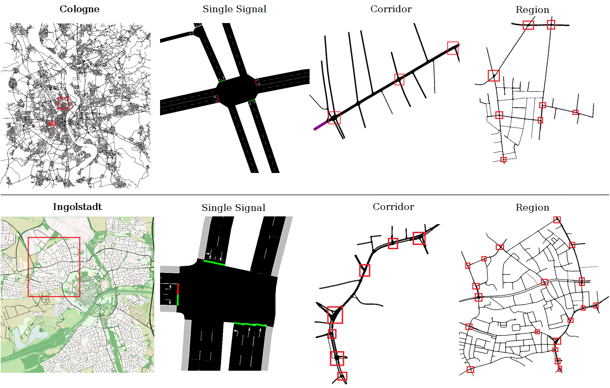

How To Make Your Deep Reinforcement Learning Model More Robust For Traffic Signal Control?
==============================================

|

This repo is a clone of private branch of the RESCO repository (https://github.com/Pi-Star-Lab/RESCO), maintained under Mr. James Ault. RESCO provides an interface for traffic network simulation and includes a set of algorithms for traffic signal control. This branch builds upon the RESCO codebase, leveraging insights from experiments conducted by Dr. Guni Sharon and Mr. James Ault, which validated the performance of DRL methods in non-stationary traffic scenarios. Images and experimental details featured in this project were also provided by Dr. Sharon and Mr. Ault.

**Quick Installation**

- Install SUMO: https://sumo.dlr.de/docs/Installing/index.html

**Quick start**

.. code-block:: bash

    cd ~/resco_benchmark
    pip install -e ../
    python main.py @ingolstadt1 @CBPIDQN

References
------------

*Ault, James, and Guni Sharon. "Reinforcement Learning Benchmarks for Traffic Signal Control."*
**Proceedings of the Thirty-fifth Conference on Neural Information Processing Systems (NeurIPS 2021) Datasets and Benchmarks Track, December 2021.**
`Reinforcement Learning Benchmarks for Traffic Signal Control <https://datasets-benchmarks-proceedings.neurips.cc/paper/2021/hash/f0935e4cd5920aa6c7c996a5ee53a70f-Abstract-round1.html>`_

